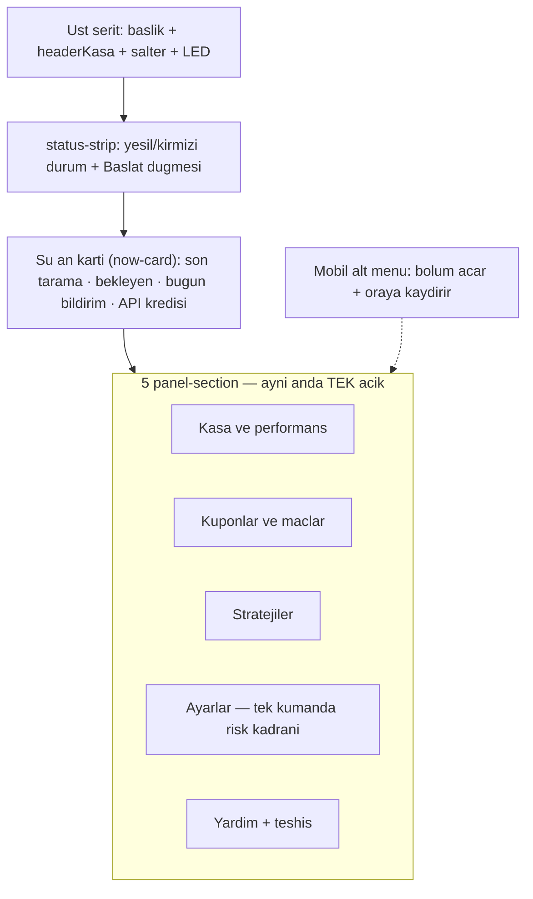

# SQE-V1 Panel UI — Bakım Manifesti

> **Amaç:** Panel arayüzü değişikliklerinde tek kaynak (single source of truth).
> **Kullanıcı kılavuzu:** `SQE_V1_Kullanim_Kilavuzu.md`
> **Son güncelleme:** 2026-08-12 · **Manifest sürümü:** 2.10.0

---

## Dosya haritası

| Dosya | Rol | Backend dokunulur mu? |
|-------|-----|------------------------|
| `index.html` | Tek dosya panel: HTML + CSS + JS | Hayır (UI-only değişiklikler) |
| `ui/web_server.py` | `/api/status` ve POST endpoint'leri | Evet (yalnızca API sözleşmesi değişirse) |
| `SQE_V1_Kullanim_Kilavuzu.md` | Operatör / kullanıcı metinleri | Hayır |
| `docs/panel-ui-manifest.md` | Bu dosya — geliştirici manifesti | Hayır |

**Kural:** Panel UX iyileştirmeleri varsayılan olarak yalnızca `index.html` içinde kalır. `index.html` her GET isteğinde diskten okunur → UI değişikliği motor restart istemez, sayfa yenilemek yeter. Yeni alan gerekiyorsa önce `/api/status` yanıtına ekle, sonra manifest + kılavuzu güncelle.

---

## Mimari (2.0 — "odak paneli", sekmeler kaldırıldı)

Tek sayfa. Her zaman görünen iki blok + 5 tek-açık katlanır bölüm:

- Bölüm iskeleti: `
` + `.panel-section-summary` (başlık + kapalıyken özet değer) + `.panel-section-body`.
- JS: `initSections()` / `openSection(id, scroll)` / `syncSectionNav(id)`; seçim `localStorage["sqe_panel_section_v1"]`'e yazılır. Alt menü düğmeleri `.tab-btn[data-section]`.
- Masaüstü (≥901px): `sectionNavTop` sekme çubuğu görünür, alt menü gizli; mobilde tersi. Her iki menü de `.tab-btn[data-section]` ve aynı sırayla: Firsatlar · Kuponlarim · Karne · Strateji (uzman) · Ayarlar · Yardim.
- **Görünüm modu (2.8.0):** `viewModeSwitch` → `body.mode-expert`. Basit modda `[data-expert-only]` işaretli öğeler gizlenir (Strateji bölümü + sekmesi, "API kredisi" kutusu). Tercih `localStorage["sqe_panel_view_mode_v1"]`. Yeni uzman-içerik eklerken öğeye `data-expert-only` koy.
- **Terim ipucu:** `.hint-dot[data-hint]` → tıklayınca toast. Yeni jargon eklenirse yanına ipucu düğmesi eklenir.
- **İlk kullanım rehberi (2.10.0):** `#onboardOverlay` (role=dialog, `hidden` ile açılır/kapanır) + `ONBOARD_STEPS` (4 adım, JS dizisi). `initOnboarding()` ilk açılışta `localStorage["sqe_panel_onboard_v1"]` yoksa gösterir; Atla/son adım/Escape işareti yazar. Yardım bölümündeki `#onboardReplay` yeniden açar. Metin değişikliği yalnızca `ONBOARD_STEPS` içinde yapılır.
- **Öneri akışı (2.9.0):** `renderRecommendations` tek giriş noktası; `latestRecommendations` ham liste, `recFilterMode` (`all|play|watch`, `localStorage["sqe_panel_rec_filter_v1"]`) süzer. Sayaçlar `[data-rec-count]`, ölçüm uyarısı `recModeNote` (`data.measurement_mode`), okunmuş kayıtlar `localStorage["sqe_panel_rec_seen_v1"]` (son 80 `match_id`). Boş durum metni `recEmptyText()` → `latestScanInfo` (`data.last_scan`) ile gerekçeli yazılır.

### Bölüm içerikleri

| Bölüm | İçerik (görünür) |
|-------|-------------------|
| Kasa ve performans | Bütçe girişi (`overviewBudgetInput`, otomatik kayıt) · Kazanma oranı · Kanıt Karnesi (`clvScorecard`) · Getiri · Net Kar · Toplam Kupon |
| Kuponlar ve maçlar | `myMatchesTable` (masaüstü) / `myMatchesCards` (mobil) · Geçmişi temizle |
| Stratejiler | HERO anahtarı (`heroModePanel` + `heroProfileAccordion`) · 3 strateji kartı (`#strategyCards`: Kart 1 `strategyCardSideToggle` CANLI → `POST /api/toggle_side_markets`, durumu `status.strategy.side_markets_enabled`, `renderStrategyCard`; Kart 2 düğmesi `disabled` + kanıt sayacı `strategyComboProofNote`'u `renderClvScorecard` doldurur; Kart 3 bilgi) |
| Ayarlar | Risk kadranı (`riskDial`, 1-6) + altında 3 hazır seviye düğmesi (`#riskDialPresets`: Guvenli=2 / Dengeli=3 / Agresif=4) · Canlı maç bildirimleri (`liveToggle`) · "Gelismis" = lig seçimi (`scanLeagueAccordion`) |
| Yardım | Rehber (pilotBanner + workflow) · **Başlangıç rehberi** (`settings-zone-help`: 6 statik tek-açık akordeon — `helpWhatIsThis` / `helpPolicy` / `helpSettings` / `helpHowToBet` / `helpScorecard` / `helpFaq`; JS okumaz, saf içerik) · Durum ve teşhis (`scanDetailAccordion`) |

### Tek kumanda kuralı (2026-07-12 sadeleştirme)

Risk kadranı `applyNotifyFrequencyLevel(level)` üzerinden tüm profili yönetir (bildirim sıklığı, stake, lig sayısı, filtreler). Hazır seviye düğmeleri de aynı yolu çağırır; aktiflik `paintRiskDial` içinde senkronlanır. Seviye 6 (Sınırsız) `window.confirm` uyarısı KORUNUR.

### Gizli ama SİLİNMEMİŞ öğeler (JS hâlâ dolduruyor — DOM'dan ÇIKARMA)

`applyStatus`/`applyPerformanceStats` bazı elemanlara korumasız yazar; şunlar gizli ama DOM'da kalmak zorunda:

- `notifyFrequencyAccordion` — CSS `display:none` (hidden attr OLMAZ: `renderHeroPanel` attr'ı toggle ediyor)
- `.budget-bar` (eski bütçe formu, `kasaInput` dahil), `settingsSnapshot`, `settingsIntro`, `overviewSnapshot`, `watchMatches`, 3 mükerrer metrik kartı (`metricRisk`, `metricWinRate`, `metricPendingKupon`) — `hidden` attr
- **Tuzak:** `.budget-bar` / `.panel-snapshot` kendi `display:flex` kuralı `hidden` attr'ı ezer → `[hidden]` hedefli CSS kuralı eklidir; yeni gizlemelerde aynı tuzağa dikkat
- `riskAccordion`, `experimentalAccordion`, `pilotAbPanel`, `riskStatEv` — önceden beri gizli

### Vurgu rengi (A4 kararı: KEHRİBAR)

Renk yalnızca iki şeye verilir: (1) o an açık öğe — bölüm sol kenarı + özet değeri, iç akordeon kenarı, seçili alt menü öğesi, seçili seviye düğmesi → `var(--warning)` #d29922 ailesi; (2) durum → yeşil `--success` / sarı `--warning` / kırmızı `--danger`. Başka hiçbir yere renk ekleme.

---

## Kritik DOM ID kaydı

JS'in `getElementById` ile aradığı ~126 kimliğin TAMAMI DOM'da olmalı (gizli olsa bile). Silmeden önce `index.html` içinde grep yap. Öne çıkanlar:

| ID | Yer | Not |
|----|-----|-----|
| `headerKasa` | Üst şerit | `applyStatus` doldurur (total_kasa) |
| `statusStripScan/Today/Credits` | "Şu an" kartı | Eski status-strip meta'sından taşındı, JS değişmedi |
| `metricOpenMatches` | "Şu an" kartı | "N kupon" (renderMyMatches) |
| `overviewSecondarySummaryValue` | Kasa bölüm başlığı | ROI özeti |
| `sectionKuponSummary` | Kupon bölüm başlığı | "N mac · M acik" |
| `strategySummaryValue` | Strateji bölüm başlığı | HERO/EV modu |
| `sectionAyarlarSummary` | Ayarlar bölüm başlığı | `updateSettingsSnapshot` doldurur |
| `riskDialRange` + `#riskDialPresets` düğmeleri | Ayarlar | Tek kumanda |

---

## JS fonksiyon kaydı (2.0 değişenler)

| Fonksiyon | Durum |
|-----------|-------|
| `switchTab` / `initTabs` | KALDIRILDI → `openSection` / `initSections` / `syncSectionNav` |
| `bindExclusivePanelAccordions()` | Duruyor — iç akordeonlar için (zone seçicileri: `.settings-zone-control/-status/-help`) |
| `paintRiskDial(levelId, live)` | + hazır seviye düğmesi aktiflik senkronu |
| `applyNotifyFrequencyLevel(level)` | Toast metni: "Risk seviyesi kaydedildi: X"; seviye 6 confirm korunur |
| Diğer tüm render fonksiyonları | Değişmedi (kimlikler korunduğu için) |

**Poll:** `fetchStatus` 5 sn, `fetchFinanceMetrics` 10 sn (değerler `index.html` başında).

---

## API bağımlılığı (`/api/status`)

Panel şu alanları bekler (eksik alan → `—`, crash olmamalı): `hero`, `notify_frequency`, `scan_leagues`, `last_scan`, `performance`, `pending_kupons`, `recent_kupons`, `scan_enabled`, `total_kasa`, `today_notifications`, `api_credits`, `risk_settings`, `risk_presets`, `experimental`, `live_alerts_enabled`, `clv_scorecard`, `strategy` (Aşama B: `{side_markets_enabled, side_market_daily_credit_cap}`).

---

## Doğrulama düzeni (agent notu)

- Motor 8765'i kullanırken önizleme aracı o porta bağlanamaz → scratchpad'e node köprüsü (8770→8765) yazıp `launch.json`'daki `bahis-panel` girişiyle başlat (scratchpad oturuma özeldir; köprü dosyası yoksa yeniden yaz).
- Motor KAPALIYKEN (ör. test için durdurulduğunda) aynı `bahis-panel-proxy.js` statik sunucuya çevrilebilir: `index.html`'i diskten sunar, `/api/*` → `{}` döner. UI-only (Yardım gibi statik) doğrulama için yeterli; panel değerleri "—" görünür ama crash olmaz.
- Doğrulamada CANLI AYARI DEĞİŞTİRME: seviye düğmesine/kadran change'ine tıklamak gerçek POST atar. Görsel test için yalnızca `input` event dispatch et (paint-only) ve değeri geri koy.
- Motor açıkken test koşma / `database/*.json` elle düzenleme yasağı geçerli.

## Güncelleme protokolü

- [ ] Bu manifest okundu; kapsam yalnızca `index.html` mi?
- [ ] DOM ID'ler korunuyor mu (gizliler dahil)?
- [ ] Tek kumanda + tek-açık bölüm + kehribar kuralları bozulmadı mı?
- [ ] Değişiklik öncesi `yedekler/` altına tarih damgalı yedek alındı mı?
- [ ] Tarayıcıda doğrulandı mı (konsol hatasız + ekran görüntüsü)?
- [ ] Manifest tarihi ve sürümü artırıldı mı? (metin/CSS = PATCH, yeni bölüm/kart = MINOR, yapı/API = MAJOR)

---

## Değişiklik günlüğü

| Tarih | Sürüm | Özet |
|-------|-------|------|
| 2026-06-24 | 1.0.0 | Faz A–D: 4 sekme, snapshot bar, kontrol/durum ayrımı, exclusive accordion |
| 2026-07-12 | 2.0.0 | Odak paneli: sekmeler kaldırıldı → üst şerit + "Şu an" kartı + 5 tek-açık bölüm; tek kumanda risk kadranı + hazır seviye düğmeleri; mükerrerler gizlendi (silinmedi); kehribar vurgu (A4); yedekler: `20260712_asamaA_panel_oncesi`, `20260712_sadelestirme_oncesi`, `20260712_renk_oncesi` |
| 2026-07-12 | 2.1.0 | Aşama B1: Stratejiler bölümüne 3 kart (yer tutucu kalktı); Kart 2 kanıt sayacı canlı; keşif raporu `docs/nesine-yan-pazar-kesif-20260712.md`; yedek: `20260712_asamaB1_oncesi` |
| 2026-07-12 | 2.2.0 | Aşama B4: Kart 1 düğmesi canlı (`/api/toggle_side_markets`, `status.strategy`); KG canlı + İY gölge motor genişletmesi; motor RESTART gerekir (B5) |
| 2026-07-12 | 2.3.0 | Yardım bölümü acemi-dostu rehbere çevrildi: `settings-zone-help` içinde 6 tek-açık akordeon (sistem ne yapar / altın kurallar / ayarları tanı / adım adım bahis / Kanıt Karnesi / SSS); yeni CSS `help-guide`/`help-rule`/`help-setting`/`help-callout`/`help-steps`; saf statik (JS + motor dokunulmadı, restart gerekmez); yedek: `20260712_yardim_oncesi` |
| 2026-07-12 | 2.4.0 | Yardım'a 7. akordeon **"Avantajimiz nedir?"** (`helpEdge`, "Bu sistem ne yapar?" ile "Altın kurallar" arasına): normal bahisçiye göre 5 üstünlük (fiyat seçimi / keskin oran kıyası / kâr payı temizliği / yarı-Kelly tutar / kapanış değeri) + hangi pazarlar nasıl oynanır (maç sonucu · alt/üst · KG canlı · İY gölge · kombine kilitli); mevcut `help-*` CSS'iyle, yeni CSS yok; tek-açık davranışı sınıf-tabanlı (`bindExclusivePanelAccordions`) otomatik kapsar; saf statik (JS + motor dokunulmadı, restart gerekmez); yedek: `20260712_avantaj_yardim_oncesi` |
| 2026-07-13 | 2.5.0 | **Panel'i Telegramsız kullanım — Aşama 1 (bildirimleri panelde göster, salt-okuma).** Yeni panel bölümü **"Gelen bildirimler"** (`sectionBildirim`, Kasa ile Kuponlar arasına): aktif bahis önerilerini `.match-card` sınıflarıyla kart kart listeler (maç · pazar etiketi · Nesine oranı · önerilen tutar · maç saati); yeni CSS yok. **Motor tarafı (restart gerekir):** `telegram_worker._cache_alert_context` artık `stake` de saklıyor + yeni salt-okuma `get_active_recommendations()` (hafızadaki `_ALERT_CONTEXT_CACHE`'ten türetir, TTL dolan öneriyi eler, hiçbir şey yazmaz); `web_server._build_status_payload` yanıtına `recommendations` eklendi (telegram_worker gec/lazy import — döngüsel import kırıldı). Panel `renderRecommendations()` verisiz durumda sakin boş-durum gösterir (restart öncesi güvenli). Aşama 1'de eylem hâlâ Telegram'da; panel "Oynadım" düğmesi Aşama 2. Telegram sessiz yedek olarak korunuyor. Yedek: `20260713_panel_bildirim_oncesi` |
| 2026-07-13 | 2.6.1 | **Güven Haritası gruplaması sadeleştirildi — "bahis türü × lig" yerine yalnız "bahis türü".** `renderConfidenceMap` artık kuponları yalnızca `market`'a göre gruplar (eski `market × sport_key` yerine); `shortLeague` yardımcı fonksiyonu ve balon etiketindeki lig eki kaldırıldı, alt-başlık "Hangi bahis turu kaniti biriktirdi?" oldu. **Neden:** çok granüler gruplamada her lig ayrı kaldığı için `MIN_SAMPLE=5` eşiği çok yavaş doluyordu; yalnız-türde MS1 gibi kategoriler tek balonda toplanıp kanıtı hızla biriktiriyor (mevcut veride 5 balon → 2 balon: "MS1 (4)", "MS2 (1)"; MS1 artık eşiğe tek kupon kala). Salt UI, motor/backend'e dokunmaz, restart gerekmez. Yedek: `20260713_guven_haritasi_market_only_oncesi` |
| 2026-07-13 | 2.7.0 | **Güven Haritası kabarcık/SVG grafiğinden "Kanıt Kartları"na çevrildi — grafik okuma bilgisi olmayan kullanıcı için.** Gerekçe: kabarcık grafiği aynı anda 4 boyut okutuyordu (yatay = kupon sayısı, dikey = ROI, balon boyutu = hacim, renk = durum) → uzman olmayan için yüksek okuma yükü; veri-görselleştirme ilke kuralı "grafiği tek cümleyle anlatamıyorsan yanlış grafik". `renderConfidenceMap` artık SVG yerine her bahis türü için bir **kart** üretir: (1) açık ad — `marketLabel` haritası "MS1"→"Ev Sahibi Kazanir (MS1)" vb.; (2) **5 doluluk noktası** (pil göstergesi mantığı, `MIN_SAMPLE`'a ilerleme); (3) tek kelimelik **karar rozeti** — yeşil "Karda" / kırmızı "Zararda" / kehribar "Toplaniyor" + detay satırı ("5 kupon · 3 tuttu · net +135 TL" veya "karar icin N kupon kaldi"). Kartlar önce-karara-varan, sonra kupon sayısına göre sıralı. **Hesaplama mantığı (kâr/eşik/sayım) birebir aynı** — yalnız gösterim değişti; `MIN_SAMPLE=5` altı gri/"Toplaniyor" kalır (dürüstlük kuralı korunur). Kaldırılanlar: SVG eksenleri, balonlar, jitter, ROI ölçeği, alttaki lejant + uzun eksen açıklaması. Yeni CSS `confidence-cards`/`confidence-card*`/`confidence-dot*`; eski `confidence-map-chart svg` + `confidence-map-legend*` CSS silindi. Üstteki olgunlaşma çubuğu (`X / 30`) korundu. Salt UI, restart gerekmez, sayfa yenilemek yeter. Node harness + statik önizleme ekran görüntüsüyle doğrulandı. Yedek: `20260713_guven_haritasi_kart_oncesi` |
| 2026-07-13 | 2.6.0 | **Kanıt Karnesi görselleştirildi — "Güven Haritası" (Aşama 1, salt-okuma, UI-only).** Kasa bölümünde Kanıt Karnesi'nin altına yeni bölüm (`confidenceMap`): olgunlaşma çubuğu (`X / 30 sonuçlanmış kupon`) + inline SVG kabarcık/dağılım grafiği. Yatay = kategori başına sonuçlanmış kupon sayısı (kanıt), dikey = kârlılık (ROI %), balon boyutu = oynanan hacim, renk = durum. `renderConfidenceMap(data.recent_kupons)` verisi mevcut `/api/status` yükünden türetir — **motor/backend'e dokunmaz**; `market × sport_key` gruplaması tarayıcıda yapılır. Dürüstlük kuralı: bir kategori `MIN_SAMPLE=5` sonuçlanmış kupona ulaşmadan renklenmez (gri = veri yetersiz), örnek sayısı hep görünür, sağ-üstte soluk yeşil "kanıt eşiği" hedef bölgesi. Yeni CSS `confidence-map*`. Saf statik: yalnız `index.html`, restart gerekmez, sayfa yenilemek yeter. Aşama 2 (tam-geçmiş backend toplayıcı) şimdilik gereksiz — toplam kupon <30 olduğu için `recent_kupons` zaten tüm geçmişi kapsıyor. Yedek: `20260713_kanit_karnesi_gorsel_oncesi` |

| 2026-08-12 | 2.10.0 | **Acemi kullanıcı yüzü — Aşama C: ilk kullanım rehberi, dokunma hedefleri, hareket duyarlılığı.** Panel ilk açılışta 4 adımlık `#onboardOverlay` rehberi gösterir (ne yapar → Fırsatlar kartı nasıl okunur → ölçüm modu güvenliği → Basit/Uzman); adım metinleri `ONBOARD_STEPS`, görüldü işareti `localStorage["sqe_panel_onboard_v1"]`, Yardım'daki `#onboardReplay` ile tekrar açılır, Escape kapatır, son adım Fırsatlar'a götürür. Mobilde (`≤900px`) `.rec-filter-btn` ve `.view-mode-btn` 44px dokunma hedefine çıkar; `prefers-reduced-motion` kapsamı overlay'i de içerir. Salt UI, backend dokunulmadı. |
| 2026-08-12 | 2.9.0 | **Acemi kullanıcı yüzü — Aşama B: bildirim merkezi ve konuşan sinyal kartı.** Fırsatlar bölümü artık bir akış: **tür filtresi** (`Tumu / Oyna adayi / Sadece izle`, canlı sayaçlı, seçim `localStorage["sqe_panel_rec_filter_v1"]`), ölçüm modunda kalıcı **`recModeNote`** uyarısı ("gerçek kupon açılmaz, kasa değişmez"), ilk kez görülen kayıtlarda **YENI** rozeti (`localStorage["sqe_panel_rec_seen_v1"]`, son 80 id). Kart, jargon yerine iki cümle veriyor: `.rec-plain` → "Nesine bu bahse 2.20 veriyor, keskin piyasanın adil fiyatı 2.00. Yani ~%10 fazla ödüyor" ve `.rec-todo` → "Ne yapmalı: …" (izle kartında açıkça "şimdilik bir şey yapma"). Boş durum artık gerekçeli: `recEmptyText()` son tarama saati + karşılaştırılan maç sayısını (`last_scan.funnel.birlesik`) kullanır. Bunun için tek backend eki: `get_active_recommendations()` payload'ına `sharp_oran` ve `ev` alanları (`_context_ev`, salt-okuma; `tests/test_panel_recommendations.py`). Bölüm özeti "N oyna · M izle" olarak değişti. Salt UI + salt-okuma API alanı, restart yalnız motor tarafı için gerekir. |
| 2026-08-12 | 2.8.0 | **Acemi kullanıcı yüzü — Aşama A: kalıcı sekme çubuğu, Basit/Uzman görünümü, terim ipuçları.** Masaüstünde `sectionNavTop` (daha önce boş olan `.tab-nav-top` yuvası) artık dolu: **Firsatlar · Kuponlarim · Karne · Strateji · Ayarlar · Yardim**; alt (mobil) menü aynı sıra ve etiketlerle eşitlendi, ikisi de mevcut `openSection`/`syncSectionNav` mekanizmasını kullanır (yeni JS akışı yok). Başlıklar günlük dile çevrildi: "Gelen bildirimler"→**Firsatlar**, "Kuponlar ve maclar"→**Kuponlarim**, "Kasa ve performans"→**Karne ve kasa**, "Iyi Adam Modu (HERO)"→**Secici mod (HERO)**. Yeni **görünüm modu anahtarı** (`viewModeSwitch`, header): `body.mode-expert` sınıfı + `body:not(.mode-expert) [data-expert-only]{display:none}` — Basit modda Strateji bölümü/sekmesi ve "API kredisi" kutusu gizlenir, tercih `localStorage["sqe_panel_view_mode_v1"]`'e yazılır; Basit'e dönerken açık Strateji bölümü kapatılıp Firsatlar açılır (`applyViewMode`, `EXPERT_SECTIONS`). Yeni **`.hint-dot`** (`data-hint`) düğmeleri Getiri/Kanıt Karnesi/Secici mod/Aktif öneriler başlıklarında — tıklanınca 6 sn'lik toast ile tek cümlelik açıklama (`initHintDots`, delege dinleyici). DOM ID silinmedi, kehribar vurgu kuralı korundu. Salt UI, restart gerekmez. |

---

*Bu dosyayı panel UI ile ilgili her oturum sonunda güncelleyin.*
