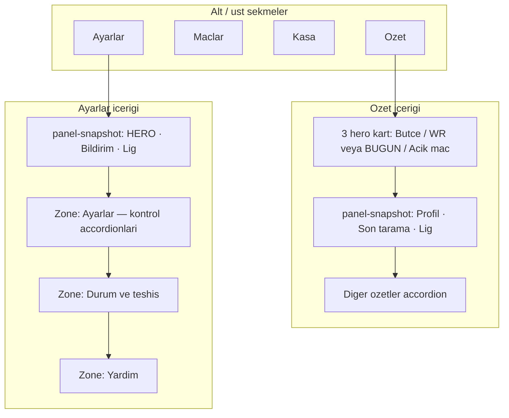

# SQE-V1 Panel UI — Bakım Manifesti

> **Amaç:** Panel arayüzü değişikliklerinde tek kaynak (single source of truth).  
> **Kullanıcı kılavuzu:** `SQE_V1_Kullanim_Kilavuzu.md` → bölüm *Panel arayüzü (4 sekme)*  
> **Son güncelleme:** 2026-06-24 · **Manifest sürümü:** 1.0.0

---

## Dosya haritası

| Dosya | Rol | Backend dokunulur mu? |
|-------|-----|------------------------|
| `index.html` | Tek dosya panel: HTML + CSS + JS | Hayır (UI-only değişiklikler) |
| `ui/web_server.py` | `/api/status` ve POST endpoint’leri | Evet (yalnızca API sözleşmesi değişirse) |
| `SQE_V1_Kullanim_Kilavuzu.md` | Operatör / kullanıcı metinleri | Hayır |
| `docs/panel-ui-manifest.md` | Bu dosya — geliştirici manifesti | Hayır |

**Kural:** Panel UX iyileştirmeleri varsayılan olarak yalnızca `index.html` içinde kalır. Yeni alan gerekiyorsa önce `/api/status` yanıtına ekle, sonra manifest + kılavuzu güncelle.

---

## Mimari (4 sekme)



---

## Tamamlanan UI fazları

| Faz | Konu | Durum | Not |
|-----|------|-------|-----|
| A | Bilgi mimarisi: 3 zone, snapshot bar, Strateji grubu | ✅ | DOM ID’ler korundu |
| B | Kontrol / durum ayrımı; chip seçici; ortak JS helper’lar | ✅ | Azalt/Artır kaldırıldı |
| C | Accordion accent; exclusive mobil; summary değerleri | ✅ | `bindExclusivePanelAccordions` |
| D | Özet snapshot; tekrarlayan metrikler kısaltıldı | ✅ | Lig formatı ortak |

**Sonraki olası işler (plan dışı):** modal/bottom sheet, React ayrıştırma, ayrı CSS dosyası — **onay olmadan yapılmaz**.

---

## Ortak UI desenleri (yeni bölüm eklerken uy)

### 1. Snapshot şeridi (`.panel-snapshot`)

- Özet ve Ayarlar üstünde salt okunur özet.
- Güncelleme: `updateOverviewSnapshot(data)` / `updateSettingsSnapshot(data)` — `applyStatus` sonunda çağrılır.
- Lig satırı: `formatOverviewLeaguesLine(leagues)` — **her iki snapshot’ta aynı**.

### 2. Accordion iskeleti

```html
<details class="ui-accordion ui-accordion-control|status|help|overview|advanced">
  <summary class="ui-accordion-summary">
    <span class="accordion-title-wrap">Baslik<span class="ui-accordion-sub">Alt baslik</span></span>
    <span class="accordion-summary-value" id="...">—</span>
  </summary>
  <div class="ui-accordion-body">...</div>
</details>
```

- **Kontrol:** `.settings-control-block` + birincil etkileşim (chip, toggle, slider).
- **Durum:** `.settings-status-block` + `.settings-status-label` — salt okunur grid (`renderSettingsLiveGrid`).

### 3. Profil seviye seçici

- `renderProfileLevelSteps(container, levels, onSelect)` — HERO ve bildirim sıklığı.
- API: `POST /api/hero_profile`, `POST /api/notify_frequency`.

### 4. Mobil exclusive accordion

- `bindExclusivePanelAccordions()` — 901px altında zone başına tek açık `<details>`.
- Zone seçicileri: `.settings-zone-control`, `.settings-zone-status`, `.settings-zone-help`, `#tabOverview .tab-panel-inner`.

---

## Kritik DOM ID kaydı

Yeni ID eklemeden önce bu listeyi kontrol edin; silmeden önce `index.html` içinde `grep` yapın.

### Özet sekmesi

| ID | Açıklama |
|----|----------|
| `overviewSnapshot` | Üst snapshot container |
| `overviewSnapshotProfile` | Profil satırı |
| `overviewSnapshotScan` | Son tarama (kısa) |
| `overviewSnapshotLeagues` | Lig sayısı / tur |
| `overviewSecondaryAccordion` | Diğer özetler |
| `overviewSecondarySummaryValue` | Accordion sağ özeti (ROI) |
| `overviewBudgetInput` | Bütçe girişi |
| `metricWinRateCard` / `metricHeroTodayCard` | HERO’a göre görünürlük |

### Ayarlar sekmesi

| ID | Açıklama |
|----|----------|
| `settingsSnapshot` | Üst snapshot |
| `strategyAccordion` | HERO + profil |
| `strategySummaryValue` | Strateji özeti |
| `heroModeToggle` | HERO anahtarı |
| `heroProfileSteps` | Kahraman chip’leri |
| `heroProfileEffectLive` | Profil etkisi (durum) |
| `heroProfileRuntimeLive` | Bugün / hafta (durum) |
| `notifyFrequencyAccordion` | HERO kapalıyken görünür |
| `scanDetailAccordion` | Durum zone — son tarama |

---

## JS fonksiyon kaydı

| Fonksiyon | Çağrıldığı yer | Sorumluluk |
|-----------|----------------|------------|
| `applyStatus(data)` | `fetchStatus` poll | Ana render orchestrator |
| `updateOverviewSnapshot(data)` | `applyStatus` sonu | Özet snapshot |
| `updateSettingsSnapshot(data)` | `applyStatus` sonu | Ayarlar snapshot |
| `renderHeroPanel(hero)` | `applyStatus` | HERO toggle + profil |
| `renderNotifyFrequency(payload)` | `applyStatus` | Bildirim profili |
| `renderProfileLevelSteps(...)` | hero / notify render | Chip UI |
| `renderSettingsLiveGrid(...)` | hero / notify durum | Salt okunur grid |
| `formatHeroStrategySummary(profile)` | Strateji summary | `Label · %XX+ · N/gun` |
| `formatNotifyAccordionSummary(payload)` | Bildirim summary | `Label · +X% EV` |
| `formatOverviewScanLine(lastScan)` | Özet snapshot | `saat · N oneri` |
| `bindExclusivePanelAccordions()` | Sayfa yükü | Mobil tek accordion |

**Poll aralığı:** `fetchStatus` — `POLL_MS` (mevcut değer `index.html` içinde).

---

## API bağımlılığı (`/api/status`)

Panel aşağıdaki alanları bekler (eksik alan → `—` gösterilir, crash olmamalı):

- `hero`, `notify_frequency`, `scan_leagues`, `last_scan`, `performance`
- `pending_kupons`, `recent_kupons`, `scan_enabled`, `total_kasa`
- `risk_settings`, `risk_presets`, `experimental`

Yeni UI alanı için backend alanı eklenirse:

1. `ui/web_server.py` payload
2. Bu manifest — *Kritik DOM / JS* tabloları
3. `SQE_V1_Kullanim_Kilavuzu.md` — kullanıcı metni
4. `tests/` — ilgili test varsa

---

## Güncelleme protokolü (agent / geliştirici)

Panel UI değişikliği yapmadan önce:

- [ ] `docs/panel-ui-manifest.md` okundu
- [ ] Değişiklik kapsamı: yalnızca `index.html` mi, API mi?
- [ ] Mevcut DOM ID’ler korunuyor mu (veya manifest güncellendi mi)?
- [ ] Kontrol / durum ayrımı bozulmadı mı?
- [ ] `python -m unittest discover -s tests -q` geçiyor mu?
- [ ] `SQE_V1_Kullanim_Kilavuzu.md` kullanıcı metni güncellendi mi?
- [ ] Manifest **Son güncelleme** tarihi ve sürüm artırıldı mı?

### Sürüm artırma

| Değişiklik | Sürüm |
|------------|-------|
| Metin / CSS ince ayar | PATCH (1.0.x) |
| Yeni accordion / snapshot satırı | MINOR (1.x.0) |
| Sekme yapısı / API sözleşmesi | MAJOR (x.0.0) |

---

## Değişiklik günlüğü

| Tarih | Sürüm | Özet |
|-------|-------|------|
| 2026-06-24 | 1.0.0 | Faz A–D: 4 sekme, snapshot bar, kontrol/durum ayrımı, exclusive accordion, özet dengeleme |

---

*Bu dosyayı panel UI ile ilgili her PR / oturum sonunda güncelleyin.*
